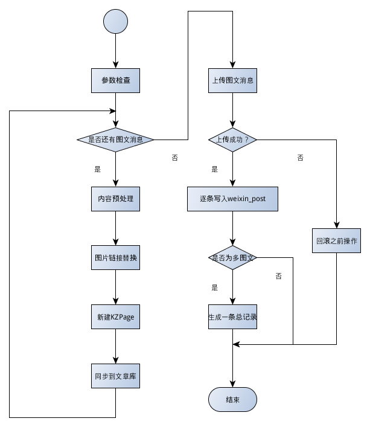

# 新建微信图文业务流程

## 流程图

## 流程说明

1. 参数检查
2. 遍历图文消息列表
3. 使用正则 匹配内容中的图片链接
4. 调用微信资源上传接口 所有图片上传至微信服务器
5. 替换图文内容中图片的链接
6. 将微信图文内容存到 MongoDB的 `page_json` 集合
7. 同步到文章库
8. 遍历完成后，将图文上传至微信服务器，若失败则删除 `page_json` 数据
9. 若成功则逐条写入 `weixin_post`，并写入审计信息
10. 如果多图文则生成一条总的记录写入 `weixin_post` 及 `page_json`
...

## 外部接口
1. 微信图片资源上传接口